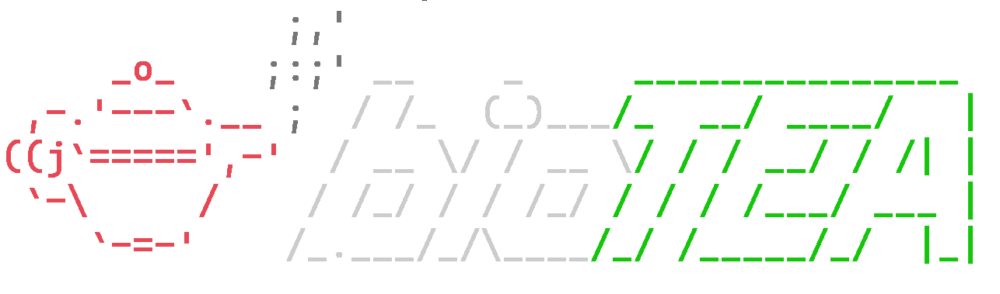

<p align="center">
    <!-- Links to shields.io. Uncomment when needed, if needed. -->
  <a href="https://github.com/CMA-Lab/bioTEA/releases"></a>
  <a href="https://pypi.org/project/biotea/"></a>
  <a href="https://github.com/CMA-Lab/bioTEA/blob/main/CONTRIBUTING.md"></a>
  <a href="https://www.python.org/"></a>
</p>

<p align="center">
  
</p>


BioTEA, where Tea is short for Transcript Enrichment Analysis, is a pipeline for Differential Gene expression Analysis with microarray and RNA-seq data.
It can download, preprocess and perform DEAs quickly, easily and in a reproducible way from the command line.

[Check out the BioTEA Docker container, where the analysis code of BioTEA lives!](https://github.com/CMA-Lab/bioTEA-box)

**Read the publication:**
> [Visentin, L.; Scarpellino, G.; Chinigò, G.; Munaron, L.; Ruffinatti, F.A. BioTEA: Containerized Methods of Analysis for Microarray-Based Transcriptomics Data. Biology 2022, 11, 1346.](https://doi.org/10.3390/biology11091346)

## Installation

> **IMPORTANT**: BioTEA works on UNIX systems. To run on Windows, use the [Windows Subsystems for Linux service](https://docs.microsoft.com/en-us/windows/wsl/install).

1. Install **Docker**. The exact process is specific to your package manager:
   - For Ubuntu, [follow this guide from the official Docker documentation](https://docs.docker.com/engine/install/ubuntu/).
   - For MacOS, [follow this guide from the official Docker documentation](https://docs.docker.com/desktop/mac/install/).
   - For Arch Linux, install with:
     ```zsh
     pacman -Syu docker
     systemctl enable --now docker.service
     ```
     You may need administrator privileges.
   - For other distros, check your distro package manager documentation.
2. Install **Python** version 3.12 or over. Again, this is dependent on your package manager:
   - On Ubuntu, run `apt update && apt install python3.9`. Depending on when you read this guide, you may need to tap into [the deadsnakes PPA](https://launchpad.net/~deadsnakes/+archive/ubuntu/ppa). Read the guides on the link I provided for more information. Just be sure that the result of `python --version` is `3.9` or higher when you continue to the following steps.
   - On Arch linux, run `pacman -Syu python`.
   - On MacOS, [follow this guide in the python docs](https://docs.python-guide.org/starting/install3/osx/).
3. **Optional** but strongly recommended: Make a Python virtual environment to use bioTEA in. You can search online for a way to do this in your OS.
4. Install bioTEA with `pip`: `pip install biotea`.

> **IMPORTANT**: Sometimes, critical bugs are fixed on the main branch but are yet to be released to PyPi.
  To get the development version of BioTEA, install it with `pip install 'biotea @ git+https://github.com/CMA-Lab/bioTEA.git#subdirectory=src/bioTea'`.
  If you run into problems, try and use this bleeding edge version, your issue might be fixed already!

If installed correctly, `biotea info` should give some information on the tool.

## Usage
The publication provides an overview of the tool and its usage. It is a good place to start. For more information on the various commands, read [the wiki](https://github.com/CMA-Lab/bioTEA/wiki).

If you run into problems using the BioTEA CLI, read [the FAQ page on the wiki](https://github.com/CMA-Lab/bioTEA/wiki/Frequently-Asked-Questions). If you still cannot solve the issue, [file a bug report](https://github.com/CMA-Lab/bioTEA/issues/new?assignees=&labels=bug&template=bug_report.md&title=%5BBUG%5D+), detailing as much as you can your problem, including the versions of bioTEA, Python interpreter, Docker engine and your OS.

If you think that the issue is coming from the docker container (i.e. the Docker container is correctly launched but the analysis fails), you can [create an issue in the bioTEA-box repository](https://github.com/CMA-Lab/bioTEA-box/issues/new).

To change the logging level used by BioTEA, set the `BIOTEA_LOG` variable to the desired log level (e.g. "DEBUG", "WARNING", etc...). By default it is "INFO".

## Contributing
To learn how you can contribute to the tool, [read the CONTRIBUTING guide](https://github.com/CMA-Lab/bioTEA/blob/main/CONTRIBUTING.md).

## Version compatibility
The BioTEA cli generally gets more frequent updates than the BioTEA box.
This causes their versions to drift apart.
We stride to keep compatibility between the BioTEA cli and the box **when the major versions are identical**. This means that all BioTEA version `x.y.z` can run any BioTEA box of version `x.*.*`.
